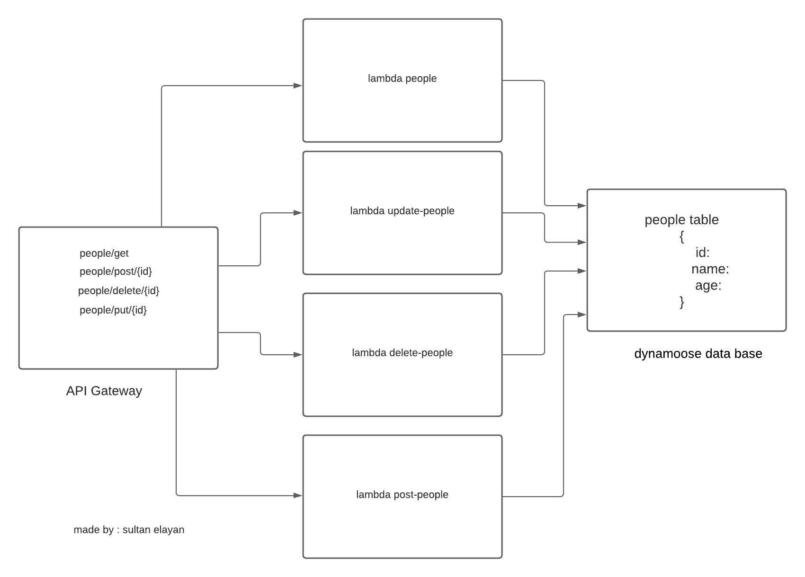

# serverless-api

## UML

### Deployment Link

[Deployment Link](https://8bmw0sk4xi.execute-api.us-east-1.amazonaws.com/people)

### What are the routes?
- people/ 
- people/post/{id}
- people/delete/{id}
- people/put/{id}

### What inputs do they require?
- { 
 name: String,
 age: Number }

What output do they return?

- { id: String,
 name: String,
 age: Number }
